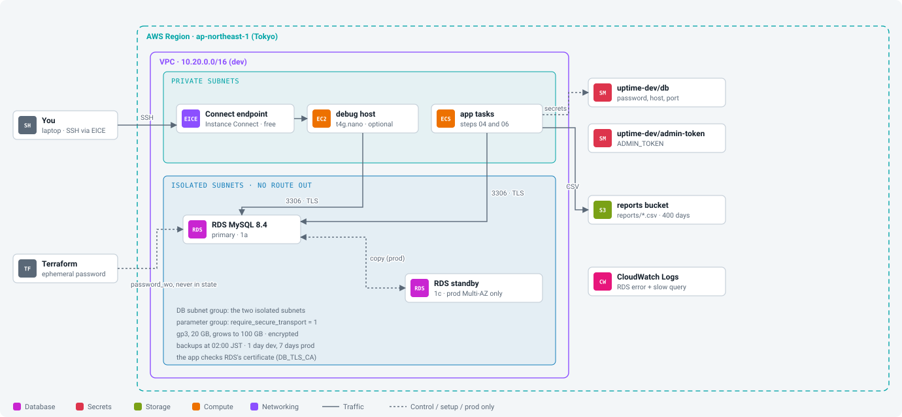

# Workbook 03: Database and secrets

Companion to the [step 03 guide](../steps/03-database-and-secrets.md). Commands marked **(AWS)** talk to your account; you run them.

<p align="center"></p>

## Before you start

- [ ] Step 02 applied in Terraform: `make tf-output env=dev stack=network` **(AWS)** shows the VPC
- [ ] Time: about 3 hours (RDS takes 5 to 10 minutes, twice). Cost: about $0.10 an hour in total now.

## Session log

| Date | Start | End | What I did | Left running? (RDS, debug host, NAT) |
|---|---|---|---|---|
| | | | | |
| | | | | |

## Values I recorded

| What | Where to get it | My value |
|---|---|---|
| database address | `make tf-output env=dev stack=data name=db_address` | |
| db secret ARN | `... name=db_secret_arn` | |
| admin token secret ARN | `... name=admin_token_secret_arn` | |
| reports bucket | `... name=reports_bucket` | |
| debug host instance ID | `make tf-output env=dev stack=security name=debug_host_instance_id` | |

## Phase 1. Understand

- [ ] What a DB subnet group decides: ______________________
- [ ] What `require_secure_transport = 1` does: ______________________
- [ ] Why the app checks the certificate, not only encrypts: ______________________
- [ ] How the password stays out of state (ephemeral + write-only): ______________________
- [ ] Why reports move to S3 on Fargate: ______________________
- [ ] Read ADRs [0008](../adr/0008-rds-mysql-single-az-dev-multi-az-prod.md), [0009](../adr/0009-database-password-write-only-no-rotation.md), [0010](../adr/0010-reports-on-s3.md).
- [ ] Locally: `docker compose run --rm -e DB_TLS_CA=/app/certs/rds-global-bundle.pem api migrate` refuses the local certificate (`x509: certificate is not valid ...`).

## Phase 2. Build by hand (guide section 4)

- [ ] 4.1 DB subnet group `uptime-dev-byhand` (isolated subnets)
- [ ] 4.2 Parameter group `uptime-dev-byhand`, `require_secure_transport = 1`
- [ ] 4.3 RDS `uptime-dev-byhand`, MySQL 8.4, `db.t4g.micro`, password managed in Secrets Manager, SG `uptime-dev-db`, not public
- [ ] 4.4 Bucket `uptime-dev-byhand-reports-ACCOUNT`, public access blocked

## Phase 3. Test (guide section 5)

- [ ] `enable_debug_host = true` in `envs/dev/security.tfvars`
- [ ] `make tf-plan env=dev stack=security` **(AWS)**: `Plan: 9 to add`; then `make tf-apply env=dev stack=security`
- [ ] `aws ec2-instance-connect ssh --instance-id i-... --connection-type eice` **(AWS)** opens a shell
- [ ] Password read from the `rds!db-...` secret
- [ ] `mysql ... --ssl-ca=rds-ca.pem --ssl-verify-server-cert` connects; `Ssl_version` is TLSv1.2 or 1.3; `@@require_secure_transport` is `1`
- [ ] `dig +short $DB` gives a `10.20.2x.x` address

## Phase 4. Break it (guide section 6)

| Experiment | Expected | What I saw |
|---|---|---|
| a) `--ssl=0` | `ERROR 3159 ... insecure transport are prohibited` | |
| b) wrong CA | certificate verify error | |
| c) remove the `db` rule for the debug host | hangs, then `(110)` timeout | |
| d) optional failover (Multi-AZ, costs ~$0.03) | IP moves to the other subnet | |

## Phase 5. Terraform (guide section 8)

Delete the hand-built database and bucket first (guide section 7), then:

```bash
make tf-plan  env=dev stack=data      # (AWS) Plan: 13 to add; password_wo = (write-only attribute)
make tf-apply env=dev stack=data      # (AWS) 5 to 10 minutes
make tf-output env=dev stack=data     # (AWS) db_address, db_secret_arn, reports_bucket ...
```
- [ ] Data stack applied (13)
- [ ] State check **(AWS)**: `aws s3 cp s3://uptime-tfstate-ACCOUNT/dev/data.tfstate - | grep '"password_wo"'` shows `null`
- [ ] Password readable in Secrets Manager: `aws secretsmanager get-secret-value --secret-id uptime-dev/db --query SecretString --output text | jq .`
- [ ] Connected from the debug host; `SHOW TABLES;` is empty
- [ ] Rotation: `db_password_version = 2`, plan shows 2 changes, apply, old password refused, new one works

## Done when

- [ ] I can connect to RDS from inside the VPC over verified TLS, and explain why I cannot from my laptop.
- [ ] I proved the password is not in the state file.
- [ ] I can say what Multi-AZ adds and costs in prod (about $38 a month on `db.t4g.small`).
- [ ] I answered the seven "check yourself" questions.

## Clean up

- [ ] Debug host off: `enable_debug_host = false`, plan and apply `security` (`9 destroyed`)
- [ ] Not going on today? **(AWS)** `make tf-destroy env=dev stack=data` (`13 destroyed`; dev keeps no final snapshot)

## If something goes wrong

| What you see | Likely cause | Fix |
|---|---|---|
| `Unable to find remote state` for security | security stack not applied in this env | apply `security` first |
| `InvalidParameterCombination` on the password | a character RDS refuses | the module's `override_special` avoids `/ @ " space`; did you change it? |
| `ERROR 1045 Access denied` | wrong or rotated password | read the secret again |
| `(110)` timeout | security group or route | `db` group must allow the debug host or app/jobs |
| secret name "already scheduled for deletion" | secret deleted with a recovery window | dev uses 0 days; in prod restore or wait |

## Notes

