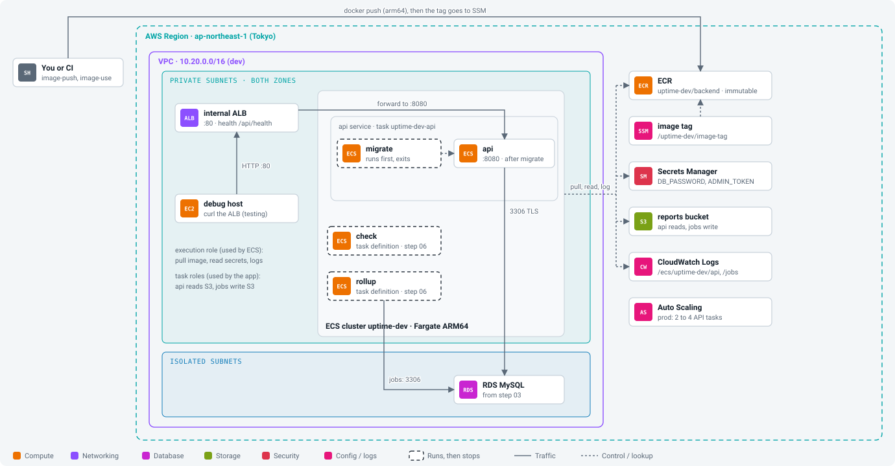

# Workbook 04: Containers on ECS

Companion to the [step 04 guide](../steps/04-containers-on-ecs.md). Commands marked **(AWS)** talk to your account; you run them.

<p align="center"></p>

## Before you start

- [ ] Steps 02 and 03 applied in dev; `make tf-output env=dev stack=data` **(AWS)** works
- [ ] Debug host on (`enable_debug_host = true` in `security.tfvars`, applied)
- [ ] `docker buildx version` works
- [ ] Time: about 4 hours. Cost: about $0.14 an hour in total now.

## Session log

| Date | Start | End | What I did | Left running? (ALB, tasks, RDS, NAT) |
|---|---|---|---|---|
| | | | | |
| | | | | |

## Values I recorded

| What | Where to get it | My value |
|---|---|---|
| ECR repository URL | `make tf-output env=dev stack=registry name=backend_repository_url` | |
| image tag deployed | printed by `make image-push env=dev` | |
| internal ALB DNS name | `make tf-output env=dev stack=compute name=alb_dns_name` | |
| run-task network string | `make -s tf-output env=dev stack=compute name=run_task_network` | |
| admin token | `aws secretsmanager get-secret-value --secret-id uptime-dev/admin-token --query SecretString --output text` | (do not write it here) |

## Phase 1. Understand

- [ ] Cluster, task definition, task, service in one line each: ______________________
- [ ] Execution role versus task role, and which one reads `DB_PASSWORD`: ______________________
- [ ] Why `migrate` is an init container ([ADR 0012](../adr/0012-migrate-as-init-container.md)): ______________________
- [ ] Why the image tag lives in SSM ([ADR 0011](../adr/0011-ecs-fargate-arm-with-pinned-image-tags.md)): ______________________
- [ ] What happens in a rolling deploy when new tasks never get healthy: ______________________

## Phase 2. Build by hand (guide section 4)

- [ ] 4.1 ECR `uptime-dev-byhand/backend` (immutable, scan on push); ARM image pushed; second push of the same tag refused
- [ ] 4.2 Roles `uptime-dev-byhand-execution` (managed policy + secrets) and `uptime-dev-byhand-api` (S3 read)
- [ ] 4.3 Log group `/ecs/uptime-dev-byhand/api`, cluster `uptime-dev-byhand`
- [ ] 4.4 Task definition from JSON (migrate + api), values filled in
- [ ] 4.5 Target group (IP, 8080, `/api/health`) and internal ALB (private subnets, sg `alb`)
- [ ] 4.6 Service: 1 task, private subnets, sg `app`, no public IP, circuit breaker with rollback; task `RUNNING`, migrate exit 0, target `healthy`

## Phase 3. Test (guide section 5), on the debug host

- [ ] `/api/health` gives `{"status":"ok"}`
- [ ] `/api/ready` gives `{"status":"ready"}`
- [ ] `/api/monitors` gives `[]`
- [ ] `dig` of the ALB name from the laptop shows only `10.20.1x.x` addresses
- [ ] `POST /api/monitors` with the token creates a monitor; without it `401`
- [ ] `aws logs tail /ecs/uptime-dev-byhand/api --follow` **(AWS)** shows `database tables are up to date`, `api listening`, request lines

## Phase 4. Break it (guide section 6)

| Experiment | Expected | What I saw |
|---|---|---|
| a) stop the task | service starts a new one; old IP draining | |
| b) tag `doesnotexist` | `CannotPullContainerError`, then rollback; curl loop never fails | |
| c) remove the secrets policy | `ResourceInitializationError: unable to pull secrets` | |
| d) remove `app` ingress from `alb` | target unhealthy, `502`/`504` | |

## Phase 5. Terraform (guide section 8)

Delete the hand-built service, ALB, roles, log group and repository first (guide section 7), then:

```bash
make tf-plan  env=dev stack=registry    # (AWS) Plan: 2 to add
make tf-apply env=dev stack=registry    # (AWS)
make image-push env=dev                 # (AWS) needs a clean app/backend; prints the tag
make image-use  env=dev tag=TAG         # (AWS) writes /uptime-dev/image-tag
make tf-plan  env=dev stack=compute     # (AWS) Plan: 17 to add (19 in prod)
make tf-apply env=dev stack=compute     # (AWS) about 3 minutes
```
- [ ] Registry applied (2)
- [ ] Image pushed and chosen
- [ ] Compute applied (17); `/api/ready` from the debug host gives `ready`
- [ ] One-off `seed` task (guide 8.5) logged `example monitors added` with `"count":2`
- [ ] One-off `check` logged `check finished`; one-off `rollup` wrote `reports/<date>.csv`; `/api/reports` lists it
- [ ] 8.6 deploy of a small change: curl loop never failed, answer changed; rolled back with `image-use` + apply

## Done when

- [ ] I can deploy a new image and roll it back, and say what the circuit breaker does.
- [ ] I can run any app command as a one-off task.
- [ ] `make tf-plan env=dev stack=compute` says `No changes`.
- [ ] I answered the seven "check yourself" questions.

## Clean up

- [ ] Not going on today? **(AWS)** `make tf-destroy env=dev stack=compute` (`17 destroyed`). Keep `registry` (cents).
- [ ] Debug host off if not needed.

## If something goes wrong

| What you see | Likely cause | Fix |
|---|---|---|
| plan fails: `ParameterNotFound: /uptime-dev/image-tag` | `image-use` not run yet | push, then `make image-use` |
| `CannotPullContainerError ... not found` | tag not in ECR, or wrong order of push/use | `make image-push`, then apply again |
| `CannotPullContainerError ... i/o timeout` | no path to ECR | NAT route, S3 endpoint, sg egress 443 |
| `ResourceInitializationError: unable to pull secrets` | execution role or secret ARN | check `read-app-secrets` policy |
| migrate exits 1 | wrong host, password or TLS | `aws logs tail /ecs/uptime-dev/api` |
| target `unhealthy` | sg `app` does not allow `alb` on 8080, or app not listening | security stack, then logs |
| `make image-push` refuses | uncommitted changes in `app/backend` | commit first |

## Notes

