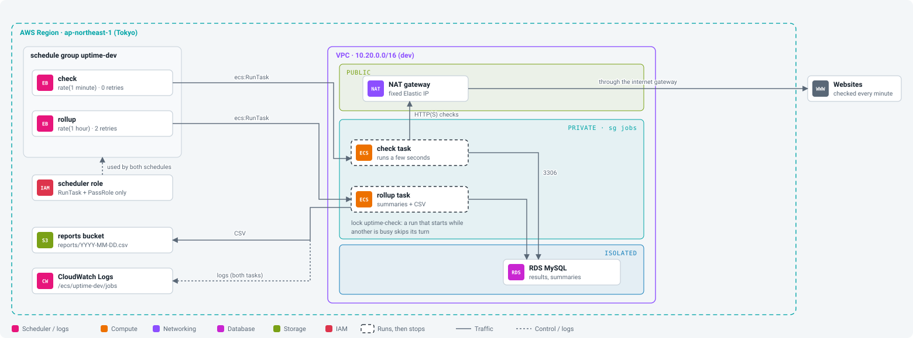

# Workbook 06: Scheduled jobs

Companion to the [step 06 guide](../steps/06-scheduled-jobs.md). Commands marked **(AWS)** talk to your account; you run them.

<p align="center"></p>

## Before you start

- [ ] Steps 02 to 05 applied in dev
- [ ] Compute stack re-applied once so it has the `*_latest` outputs (guide section 3)
- [ ] Time: about 2 hours. Cost: about $0.30 a day for the check task.

## Session log

| Date | Start | End | What I did | Left running? (schedules on?) |
|---|---|---|---|---|
| | | | | |
| | | | | |

## Values I recorded

| What | Where to get it | My value |
|---|---|---|
| check task definition (no revision) | `make tf-output env=dev stack=compute name=check_task_definition_arn_latest` | |
| schedule group | `make tf-output env=dev stack=jobs name=schedule_group` | |
| one run: created to started (seconds) | `describe-tasks` in guide section 5 | |
| one run: started to stopped (seconds) | same | |

## Phase 1. Understand

- [ ] Why a fresh task per run, and not a container with timers ([ADR 0014](../adr/0014-eventbridge-scheduler-runs-ecs-tasks.md)): ______________________
- [ ] Why the target has no revision number: ______________________
- [ ] What `iam:PassRole` protects against: ______________________
- [ ] Why check has 0 retries and rollup has 2: ______________________

## Phase 2. Build by hand (guide section 4)

- [ ] Schedule `check-byhand`: rate 1 minute, flexible window off, ECS RunTask, `uptime-dev-check` latest, private subnets, sg `jobs`, no public IP, new role
- [ ] Read the role the console made

## Phase 3. Test (guide section 5)

- [ ] Stopped check tasks grow by about one per minute
- [ ] One task: exit `0`; about 20 to 40 s to start, a few seconds to run
- [ ] `aws logs tail /ecs/uptime-dev/jobs --since 5m --format short` **(AWS)**: `check finished` every minute
- [ ] App through CloudFront updates by itself

## Phase 4. Break it (guide section 6)

| Experiment | Expected | What I saw |
|---|---|---|
| a) five runs at once (`--count 5`) with a slow monitor | one or two `check finished`, rest `skipping run` | |
| b) remove `PassRole` from the role | no tasks start; `TargetErrorCount` rises | |
| c) remove the private NAT route | tasks fail with `CannotPullContainerError` or `ResourceInitializationError` | |
| d) disable the schedule | checks stop; nothing deleted | |

## Phase 5. Terraform (guide section 8)

Delete `check-byhand` and its role first (guide section 7), then:

```bash
make tf-plan  env=dev stack=jobs      # (AWS) Plan: 5 to add
make tf-apply env=dev stack=jobs      # (AWS)
make tf-output env=dev stack=jobs     # (AWS) schedules = check rate(1 minute), rollup rate(1 hour)
```
- [ ] Jobs applied (5)
- [ ] Within the hour: `day summarised` in the logs and today's CSV in `s3://uptime-dev-reports-ACCOUNT/reports/`
- [ ] Pause test: `schedules_enabled = false`, `2 to change`, applied; back to `true`, applied

## Done when

- [ ] Checks run every minute with nobody watching, and the app shows fresh results.
- [ ] I can find one run in ECS and in the logs and say how long it took.
- [ ] I can pause and resume the jobs of an environment.
- [ ] I answered the six "check yourself" questions.

## Clean up

- [ ] Pause: `schedules_enabled = false` and apply `jobs`, or **(AWS)** `make tf-destroy env=dev stack=jobs` (`5 destroyed`)

## If something goes wrong

| What you see | Likely cause | Fix |
|---|---|---|
| plan fails: output `check_task_definition_arn_latest` not found | compute stack not re-applied after step 06 code | apply `compute` once |
| no tasks start, `TargetErrorCount` up | scheduler role (RunTask or PassRole) | compare with `terraform/stacks/jobs/main.tf` |
| tasks start and stop with exit 1 | app error | `aws logs tail /ecs/uptime-dev/jobs` |
| every run says `skipping run` | a run is stuck holding the lock | stop old RUNNING check tasks; the lock frees when its connection closes |
| no report today | rollup has not run yet this hour, or failed | wait, or run the rollup task by hand |

## Notes

