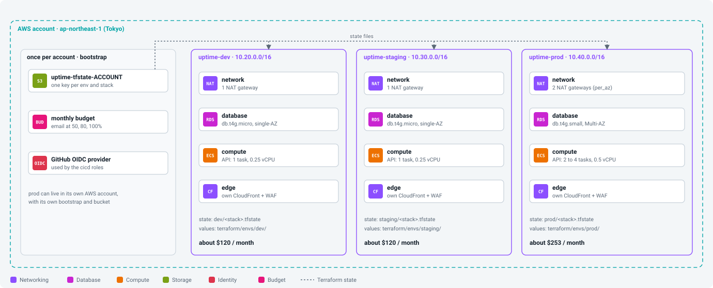

# Workbook 09: Rebuild and replicate

Companion to the [step 09 guide](../steps/09-rebuild-and-replicate.md). Commands marked **(AWS)** talk to your account; you run them.

<p align="center"></p>

## Before you start

- [ ] Steps 02 to 08 done in dev
- [ ] Time: about 3 hours, mostly waiting. Cost: staging adds about $0.16 an hour while it exists.

## Session log

| Date | Start | End | What I did | Left running? (which environments) |
|---|---|---|---|---|
| | | | | |
| | | | | |

## Values I recorded

| What | Where to get it | My value |
|---|---|---|
| staging URL | `make tf-output env=staging stack=edge name=url` | |
| staging NAT IP | `make tf-output env=staging stack=network name=nat_public_ips` | |
| teardown time for dev | your clock | |
| rebuild time for dev | `time` output | |
| new dev URL after rebuild | `make tf-output env=dev stack=edge name=url` | |

## Phase 1. Understand

- [ ] Every difference between dev and prod, and where it is written: ______________________
- [ ] Why destroy goes in reverse order: ______________________
- [ ] What Terraform does **not** bring back (guide section 6): ______________________

## Phase 2. Replicate staging (guide section 3)

- [ ] Account ID in `envs/staging/backend.hcl` and `common.tfvars`

```bash
make tf-up env=staging stacks="network security data registry"      # (AWS) 25, 12, 13, 2
make image-push env=staging                                          # (AWS)
make image-use  env=staging tag=TAG                                  # (AWS)
make tf-up env=staging stacks="compute edge jobs observability cicd" # (AWS) 17, 11, 5, 19/20, 2
make web-deploy env=staging                                          # (AWS)
```
- [ ] Foundation applied
- [ ] Image pushed and chosen
- [ ] Rest applied; staging URL opens
- [ ] Seeded with a one-off task (`uptime-staging` names); checks run
- [ ] Two VPCs listed (`10.20.0.0/16`, `10.30.0.0/16`); dev unchanged

## Phase 3. Tear down dev (guide section 4)

```bash
time make tf-down env=dev    # (AWS) reverse order, yes for each
```
- [ ] All stacks destroyed
- [ ] Leftovers handled: `CloudFront-VPCOrigins-Service-SG`, SSM `/uptime-dev/image-tag` (keep or delete)
- [ ] Tagging API shows `[]` for `Environment=dev` in Tokyo and `us-east-1`
- [ ] No dev NAT gateway, Elastic IP or RDS instance left

## Phase 4. Rebuild dev from zero (guide section 5)

```bash
time make tf-up env=dev stacks="network security data registry"      # (AWS)
make image-push env=dev && make image-use env=dev tag=TAG             # (AWS) push BEFORE use
time make tf-up env=dev stacks="compute edge jobs observability cicd" # (AWS)
make web-deploy env=dev                                               # (AWS)
```
- [ ] Rebuilt without a console click
- [ ] Seeded again; app works at the new URL
- [ ] Listed what changed: URL, NAT IP, admin token, data gone

## Phase 5. Prod readiness (guide section 7)

- [ ] Decided: prod in its own account? ______
- [ ] Domain chosen? ______
- [ ] Alert destination someone reads? ______
- [ ] `prod` GitHub environment with reviewers? ______
- [ ] Restore drill planned? ______

## Done when

- [ ] Staging was made from values only.
- [ ] Dev was deleted to zero and rebuilt from zero, and I know how long each took.
- [ ] I can name what a rebuild does not bring back and how prod protects against it.
- [ ] I answered the six "check yourself" questions.

## Clean up

```bash
make tf-down env=staging    # (AWS)
make tf-down env=dev        # (AWS), when you are done with the whole track
```
- [ ] Both gone, checked with the commands in guide section 4.3
- [ ] Bootstrap kept, or removed as in the guide's last section

## If something goes wrong

| What you see | Likely cause | Fix |
|---|---|---|
| `tf-down` stops at a stack that was never applied | its remote state reads fail | leave it out with `stacks="..."` |
| `network` destroy: `DependencyViolation` | `CloudFront-VPCOrigins-Service-SG` or another leftover in the VPC | delete it, destroy again |
| prod destroy refused | deletion protection, final snapshot, no force-destroy | on purpose; change the values first, deliberately |
| compute apply: tasks fail to pull | `image-use` before `image-push` | push, apply again |

## Notes

