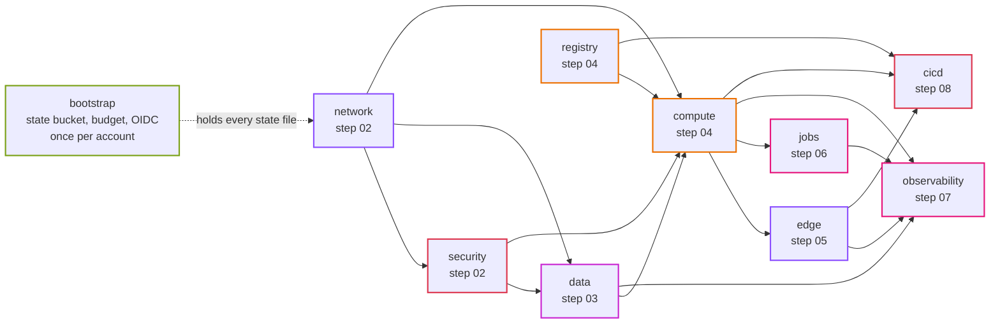

# Terraform

The AWS setup for Uptime, as code. It is built up one step at a time; each step's guide in [docs/steps](../docs/steps/README.md) explains its part.

```
bootstrap/     state bucket and budget, once per AWS account (local state)
modules/       reusable building blocks; no provider or backend settings
stacks/        root modules you plan and apply, one per layer, one state file each
envs/<env>/    only values: backend.hcl, common.tfvars, <stack>.tfvars
```

Why this layout: [ADR 0007](../docs/adr/0007-terraform-layout-stacks-and-environments.md).

## Stacks, in order



An arrow means "reads the outputs of" (`terraform_remote_state`). To keep the picture readable it shows the main ones; `edge` and `jobs` also read `network` and `security`. Apply along the arrows (the order in `TF_STACKS`), destroy against them.

Each stack reads the outputs of the ones above it, so apply them top to bottom and destroy them bottom to top.

| Stack | Step | What it holds |
|---|---|---|
| `network` | 02 | VPC, subnets, internet gateway, NAT gateways, route tables, S3 endpoint |
| `security` | 02 | security groups for the load balancer, API tasks, job tasks and database; the optional debug host (03) |
| `data` | 03 | RDS MySQL, its password in Secrets Manager, the reports bucket |
| `registry` | 04 | the ECR repository (before compute, because the image must exist first) |
| `compute` | 04 | ECS cluster, task definitions, the API service, the internal load balancer, IAM roles, log groups |
| `edge` | 05 | CloudFront with a VPC origin, the web bucket, WAF (in us-east-1), optional domain and certificate |
| `jobs` | 06 | EventBridge Scheduler schedules for check and rollup |
| `observability` | 07 | alarms, SNS topic, dashboard, log metric filters |
| `cicd` | 08 | GitHub OIDC provider and deploy roles |

## Commands

All of them run Terraform in Docker. The ones marked AWS use your credentials (`AWS_PROFILE`), and you run them yourself.

```bash
make tf-bootstrap account_id=123456789012 budget_email=you@example.com   # AWS, once
make tf-plan    env=dev stack=network                                    # AWS
make tf-apply   env=dev stack=network                                    # AWS
make tf-output  env=dev stack=network                                    # AWS
make tf-destroy env=dev stack=network                                    # AWS
make tf-fmt                                                              # local
make tf-validate                                                         # local, no credentials needed
```

Extra variables for one run: `vars="-var nat_gateway_mode=none"` (with `stack=network`).

## A new environment

1. Copy `envs/dev` to `envs/<name>` and change the values (account ID, VPC range, sizes). The name must be short and lowercase (`qa`, `perf`).
2. Apply the stacks in order with `env=<name>`.

Step 09 walks through this for staging.

## Rules

- Modules never contain `provider` or `backend` blocks. Stacks do.
- Every difference between environments is a variable with its value in `envs/`. No `if env == "prod"` in the code.
- Every resource gets `Project`, `Environment`, `Stack` and `ManagedBy` tags from `default_tags`.
- Secrets never go in `.tfvars` files or in state. See step 03.
